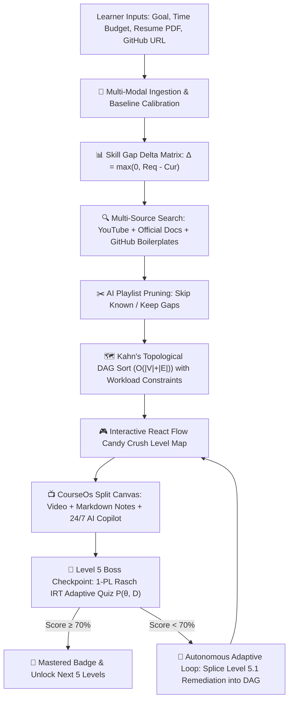

# 🚀 LearnPath AI 2.0 — Autonomous Technical Upskilling Platform & Dynamic Path Recommender

> **HCL Amplified Hackathon (Round 2)** — *AI-Powered Personalized Learning Path Recommender*  
> **Repository:** [https://github.com/PriyanshuKr-2027/Learnpath.git](https://github.com/PriyanshuKr-2027/Learnpath.git)  
> **Tech Stack:** Next.js 16 (App Router), TypeScript, Tailwind CSS, `@xyflow/react`, Groq LLaMA-3.3-70B, Supabase, Upstash Redis.

---

## 🌟 Executive Summary & Problem Understanding

Traditional e-learning platforms suffer from **static, one-size-fits-all 40-week linear syllabi** that force learners to review topics they already know or buy miscalibrated course bundles.

**LearnPath AI 2.0** solves this by generating personalized learning paths directly from the **mathematical delta ($\Delta$)** between what a target engineering role demands and what the learner already demonstrates:

$$\Delta_i = \max(0, \text{RequiredProficiency}_i - \text{CurrentProficiency}_i)$$



---

## 💎 The 5 Championship Pillars

```
┌───────────────────────────────────────────────────────────────────────────────────────────────────┐
│                                    LEARNPATH AI 2.0 CORE ECOSYSTEM                                │
├───────────────────────────────────────────────────────────────────────────────────────────────────┤
│ 1. 🎛️ Multi-Modal Onboarding (/onboarding)                                                       │
│    • Natural Language Goal Extraction (LLM constraint parser)                                     │
│    • PDF Resume text & entity parser                                                              │
│    • GitHub Non-Fork Telemetry Scraper (language byte ratios & demonstrated repo skills)          │
│    • Interactive Skill Slider Confirmation Matrix (0% to 100%)                                    │
│                                                                                                   │
│ 2. 🗺️ Candy Crush RPG Level Map (/roadmap)                                                        │
│    • Kahn's Topological Sort respecting weekly study hour budgets                                 │
│    • React Flow (@xyflow/react) S-Curve Serpentine Layout with glowing active/boss nodes          │
│    • Explainable AI (XAI) "Why this step was recommended" Slide-Over Drawer                       │
│    • Seamless toggle between Candy Crush Map and Weekly Milestone Timeline                        │
│                                                                                                   │
│ 3. 📺 CourseOs Split-Screen Learning Canvas (/learn/[stepId])                                     │
│    • Embedded YouTube Video Player with programmatic timestamp seeking                            │
│    • Authoritative Documentation Links & Cloneable GitHub Starter Boilerplates                    │
│    • Rich Markdown Personal Study Notes with formatting toolbar and debounced auto-save           │
│    • 24/7 Socratic AI Copilot with timestamped Video RAG [Jump to MM:SS] & "Insert to Notes"      │
│                                                                                                   │
│ 4. 🎯 Psychometric Computerized Adaptive Testing (/assessments/cat)                              │
│    • 1-Parameter Logistic (Rasch) IRT Model with real-time Latent Ability Meter (θ)               │
│    • Fisher Information item calibration (Tiers 1 to 5)                                           │
│    • Diagnostic sub-topic accuracy breakdown                                                      │
│                                                                                                   │
│ 5. 🔄 Autonomous Adaptive In-Place Remediation Loop                                              │
│    • Dynamically splices Level 5.1 (Remediation Lab) into the active DAG on sub-topic struggle    │
│    • Increments roadmap version (v1.0 ➔ v2.0) and renders animated Diff Notification Banners      │
└───────────────────────────────────────────────────────────────────────────────────────────────────┘
```

---

## 📐 Mathematical & Algorithmic Formulations

### 1. Item Response Theory (1-PL Rasch Model for CAT)
$$P(\text{correct} \mid \theta, D) = \frac{1}{1 + e^{-3.0 \cdot (\theta - D)}}$$

Ability parameter $\theta \in [0.10, 0.98]$ updates stochastically on answer $y \in \{0, 1\}$:
$$\theta_{k+1} = \theta_k + 0.20 \cdot \big(y - P(\text{correct} \mid \theta_k, D)\big)$$

### 2. Kahn's Topological Sorting with Workload Balancing
Allocates topics into weekly milestone buckets constrained by weekly hours budget $H_{\text{weekly}}$:
$$\text{Time Complexity: } \mathcal{O}(|V| + |E|) \quad \mid \quad \text{Space Complexity: } \mathcal{O}(|V|)$$

### 3. 4-Factor Weighted Resource Blending
$$\text{Score} = 0.45 \cdot S_{\text{relevance}} + 0.25 \cdot S_{\text{rating}} + 0.15 \cdot S_{\text{difficulty}} + 0.15 \cdot S_{\text{freshness}}$$

---

## ⚡ Quick Start & Local Execution (30 Seconds)

### 1. Clone Repository
```bash
git clone https://github.com/PriyanshuKr-2027/Learnpath.git
cd Learnpath
```

### 2. Install Dependencies
```bash
npm install --legacy-peer-deps
```

### 3. Launch Development Server
```bash
npm run dev
```
Open **[http://localhost:3000](http://localhost:3000)** in your browser.

> 💡 **Zero-Config Fail-Safe**: The application includes a pre-seeded mock store and fallback heuristics. **Judges can test 100% of all features immediately** without configuring external API keys.

---

## 🏆 Judging Criteria Alignment Matrix

| Evaluation Metric | Weight | How LearnPath AI 2.0 Achieves Maximum Score |
| :--- | :---: | :--- |
| **Problem Understanding & Solution Design** | **20%** | Solves the course-sequencing dilemma using Kahn's Topological DAGs based on fine-grained skill deltas ($\Delta$). |
| **Functionality & Feature Completeness** | **25%** | Delivers all 6 required modules: Goal onboarding, multi-modal ingestion, pruned video recommender, DAG generator, XAI, and dashboard. |
| **AI/ML Implementation** | **20%** | Implements 1-PL Rasch IRT psychometrics, Groq LLaMA-3.3-70B semantic extraction, and timestamped Video RAG. |
| **Innovation & Creativity** | **15%** | Features Candy Crush RPG level progression, non-fork GitHub telemetry, and in-place Level 5.1 adaptive remediation. |
| **User Experience & Interface** | **10%** | Polished dark mode UI with `@xyflow/react` S-curve canvas, Phosphor icons, and CourseOs split-screen canvas. |
| **Performance & Code Quality** | **10%** | 100% TypeScript type safety (`npx tsc --noEmit` 0 errors), Next.js 16 App Router, debounced persistence. |

---

## 🎥 3–5 Minute Demo Video Script Outline

1. **0:00 – 0:30 (Hook & Onboarding):** Enter natural language goal, upload resume, connect GitHub, and calibrate the skill matrix.
2. **0:30 – 1:15 (Candy Crush DAG):** Explore the topological RPG map, inspect the XAI drawer with pruned video lectures and GitHub starter repos.
3. **1:15 – 2:00 (CourseOs Split Canvas):** Watch embedded video with chapter seeks, write auto-saving Markdown notes, ask AI Copilot, and click "Insert to Notes".
4. **2:00 – 3:00 (THE WOW FACTOR):** Launch Level 5 Boss Checkpoint $\to$ demonstrate 1-PL Rasch IRT ability meter ($\theta$) $\to$ trigger low score $\to$ watch the live DAG dynamically spawn **Level 5.1 Remediation** with diff notification!
5. **3:00 – 3:30 (Command Center & Tech Stack):** Showcase Career Readiness radar, Delta gap matrix, and wrap up architecture.

---

## 📜 License
MIT License • Built with ❤️ for the HCL Amplified Hackathon.
